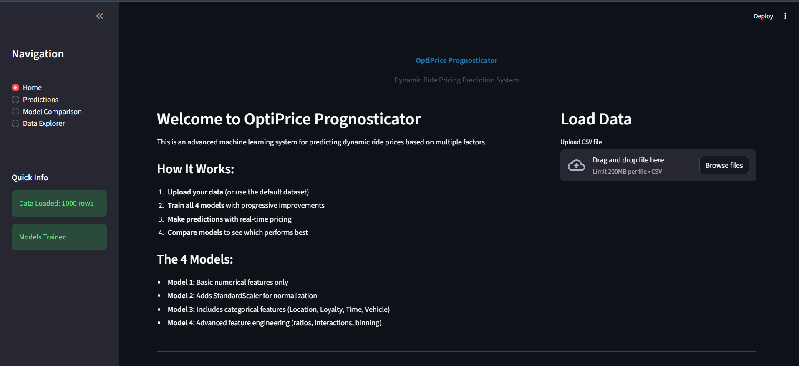
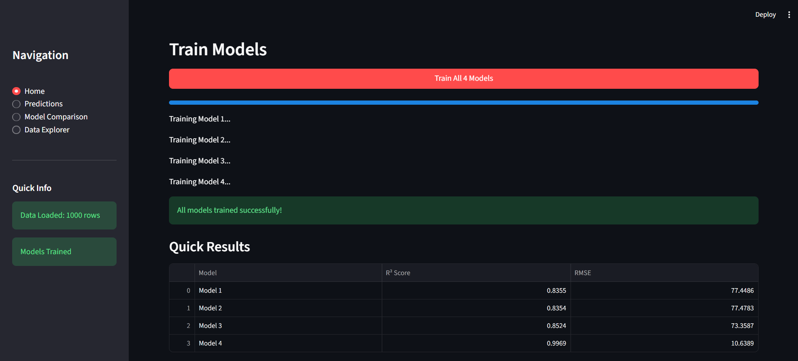
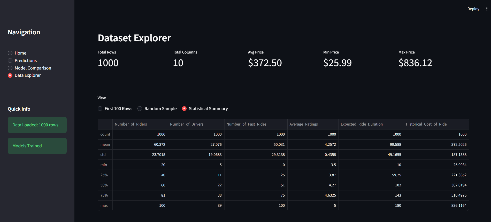
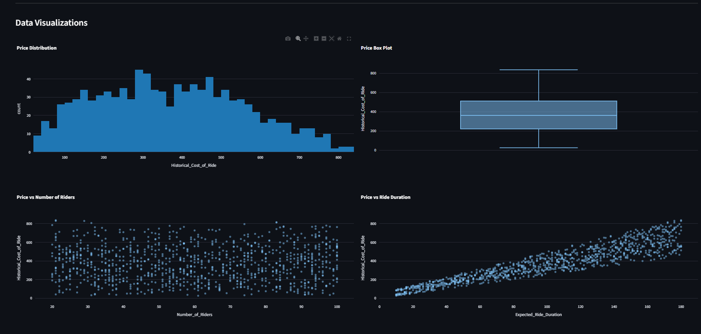
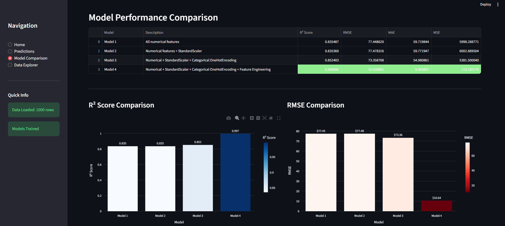
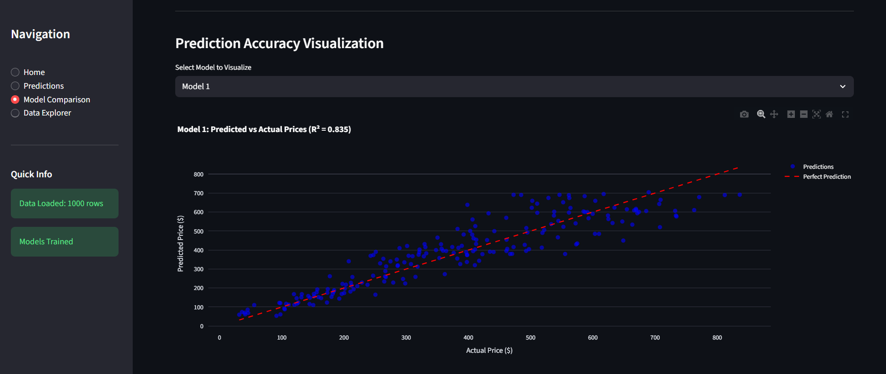
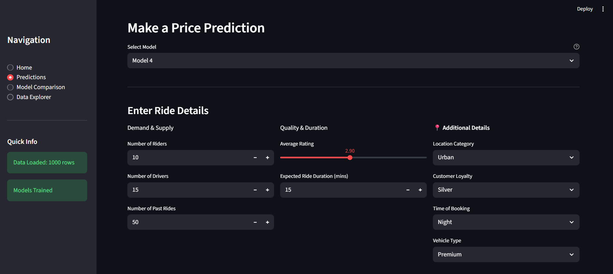
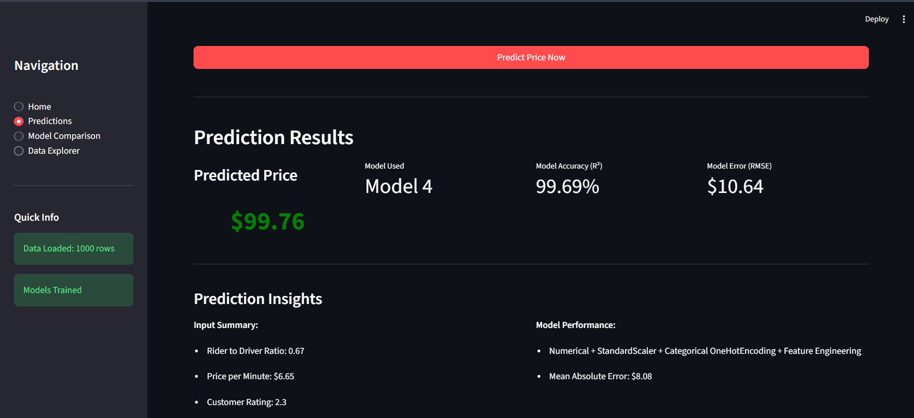

# OptiPrice Prognosticator – Prediction Model

A Streamlit-based machine learning application that predicts optimal pricing using historical data and regression models.  
This project demonstrates an end-to-end ML workflow with interactive visualizations and model evaluation.

## Tech Stack
- Python
- Streamlit
- Pandas, NumPy
- Scikit-learn
- Plotly

## Problem Statement
Pricing decisions play a crucial role in revenue and demand optimization.  
This project predicts optimal prices by analyzing historical pricing data and relevant features using machine learning models.

## Project Structure
```
OptiPrice-Prognosticator-Prediction/
├── app.py
├── data/
│   └── dynamic_pricing.csv
├── models/
│   ├── model1.py
│   ├── model2.py
│   ├── model3.py
│   └── model4.py
├── screenshots/
├── requirements.txt
└── README.md
```

## Features
- Data preprocessing and feature handling
- Multiple regression models for price prediction
- Model evaluation using RMSE, MAE, and R² score
- Interactive visualizations using Plotly
- Streamlit-based interactive dashboard

## Screenshots

### Home Dashboard



### Dataset Explorer & Statistics



### Model Comparison



### Price Prediction – Input


### Price Prediction – Output



## How to Run the Application

1. Clone the repository
```bash
git clone https://github.com/Thogaivalli-26/OptiPrice-Prognosticator-Prediction.git
```

2. Navigate to the project directory
```bash
cd OptiPrice-Prognosticator-Prediction
```

3. Install dependencies
```bash
pip install -r requirements.txt
```

4. Run the Streamlit app
```bash
streamlit run app.py
```

5. Open in browser
```
http://localhost:8501
```

## Dataset
- File: `dynamic_pricing.csv`
- Location: `data/` folder
- Used for training and evaluating pricing prediction models

## Future Improvements
- Hyperparameter tuning
- Model comparison dashboard
- Deployment on Streamlit Cloud
- API integration

## License
MIT License
